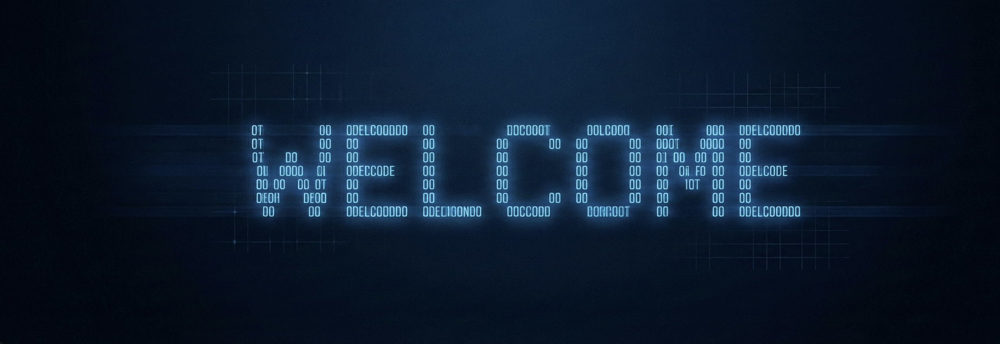

<h1 align="center">Alvaro Marcal de Araujo</h1>

  <strong>Infrastructure • DevOps • Networking • AI Systems</strong>

  Network & Communications Engineering Student @ UnB  
  Computer Science Student @ UniCEUB  
  Brasília, DF — Brazil

  <a href="https://www.linkedin.com/in/alvaro-marcal-dearaujo/">LinkedIn</a> •
  <a href="https://github.com/Alvaromra">GitHub</a>

  

---

# 👨‍💻 About Me

Network & Communications Engineering student at the Universidade de Brasília (UnB) and Computer Science student at UniCEUB, with hands-on experience in infrastructure, DevOps, systems integration and AI-powered automation.

Currently working with:
- Linux infrastructure
- Dockerized environments
- CI/CD pipelines
- WSO2 integrations
- REST APIs
- Local AI systems with Ollama and GGUF models

Experience with automation, troubleshooting, technical documentation and support for internal critical services.

Interested in building scalable systems combining networking, backend infrastructure and applied artificial intelligence.

---

# 🚀 Featured Projects

## 📄 ScanDocs AI — Local Document Intelligence Platform

AI-powered document processing platform focused on local and private environments.

### Features
- PDF, DOCX, CSV, XLSX, JSON and TXT processing
- Intelligent pattern extraction
- RAG architecture with automatic reindexing
- Local LLM integration via Ollama
- LoRA/GGUF training compatibility
- Floating AI assistant interface
- FastAPI + Flask + PostgreSQL architecture
- Docker Compose deployment

### Technologies
`Python` `FastAPI` `Flask` `PostgreSQL` `Docker` `Ollama` `RAG`

---

## 🧠 SalaryAI Suite — AI Salary Prediction Engine

Self-learning platform for salary prediction and intelligent data analysis.

### Features
- Continuous retraining
- Performance dashboards
- Modular backend
- Local AI model support
- Dataset expansion pipeline

### Technologies
`Python` `Flask` `SQLite` `GGUF` `LoRA`

---

## 🛡️ ALVSafe Antivirus

Cross-platform antivirus and endpoint protection platform developed in Python.

### Features
- File scanning engine
- Heuristic malware detection
- YARA rule integration
- Real-time monitoring
- Ransomware protection
- Quarantine management
- Web dashboard and GUI
- Basic firewall module
- VirusTotal integration

### Technologies
`Python` `YARA` `Flask` `SQLite` `Watchdog`

---

## 🏠 Primeiro-Imovel-Pro

Financial planning platform for mortgage and property simulation.

### Features
- Financing simulation
- Financial projections
- Planning calculations

### Technologies
`Python`

---

# 🧰 Technical Skills

## Infrastructure & DevOps
- Linux
- Docker
- Docker Compose
- Ansible
- GitLab CI/CD
- Jenkins
- OpenShift
- Nginx
- Apache

## AI & Automation
- Python
- LLMs
- Ollama
- RAG
- TF-IDF
- GGUF
- LoRA

## Backend & Databases
- FastAPI
- Flask
- REST APIs
- PostgreSQL
- SQLite
- JSON
- YAML

## Networking
- TCP/IP
- VLAN
- OSPF
- BGP
- DNS
- VPN
- Firewalls

---

# 🏢 Experience

## Infrastructure & DevOps Intern
**Heiliger Tecnologia e Software**  
*Apr 2025 — Mar 2026*

- Infrastructure support and troubleshooting
- Deployment automation using Ansible
- REST API integrations
- Linux server administration
- Containerized services support

---

## Volunteer — Exata Falada Project (AI & Digital Accessibility)
**Universidade de Brasília (UnB)**  
*2026 — Present*

Project focused on accessibility and AI-assisted educational content adaptation.

- Accessible HTML validation
- OCR and AI-assisted workflows
- Accessibility testing and improvements
- Semantic HTML and ARIA support

---

# 📊 GitHub Statistics

  
  

---

# 📚 Currently Learning

- Kubernetes
- Cloud Infrastructure
- AI Infrastructure
- Distributed Systems
- Platform Engineering

---

# 📫 Contact

📧 alvaromra2@gmail.com

🔗 LinkedIn:
https://www.linkedin.com/in/alvaro-marcal-dearaujo/
